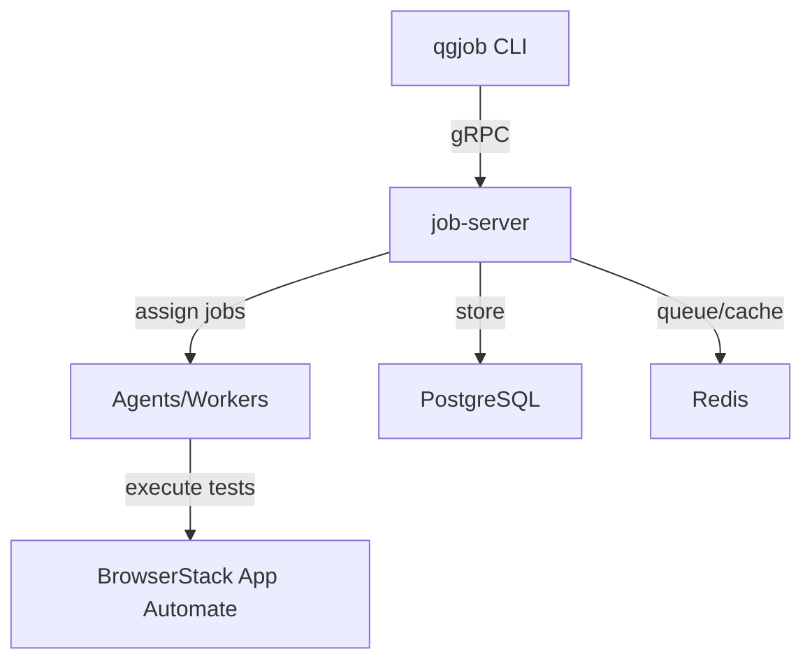

# QualGent Test Platform

A scalable, modular, and resilient test orchestration platform for distributed end-to-end test execution across emulators, real devices, and BrowserStack App Automate.

---

## Features

- **Distributed Architecture**: Multiple agents/workers can process jobs in parallel.
- **Smart Scheduling**: Jobs are automatically grouped by `app_version_id` and `target` to minimize redundant app installs.
- **Multi-Target Support**: Run tests on emulators, real devices, or BrowserStack App Automate.
- **AppWright Integration**: Native support for AppWright test execution via BrowserStack.
- **High Availability**: Supports horizontal scaling and crash recovery.
- **Idempotency**: Prevents duplicate job submissions and executions.
- **Real-Time Monitoring**: Full job lifecycle tracking and logging.
- **CLI Tool**: Intuitive command-line interface for job submission and status checks.
- **CI/CD Integration**: Ready for GitHub Actions and other CI pipelines.

---

## Architecture



- **qgjob CLI**: User-facing tool for submitting and tracking jobs.
- **job-server**: Central orchestrator, exposes gRPC API, handles scheduling, grouping, and state.
- **Agents**: Pluggable workers that execute grouped jobs, including AppWright Agent for BrowserStack.
- **BrowserStack App Automate**: Cloud-based mobile app testing platform.
- **PostgreSQL**: Persistent job and group storage.
- **Redis**: Fast queueing, distributed locks, and caching.

---

## Quick Start

### Prerequisites

- Go 1.20+
- Docker & Docker Compose
- PostgreSQL 14+
- Redis 7+
- Protocol Buffers compiler (`protoc`)
- BrowserStack account with App Automate access

### Installation

1. **Clone the repository**
   ```bash
   git clone <repository-url>
   cd qualgent-test-platform
   ```

2. **Install Go dependencies**
   ```bash
   go mod download
   ```

3. **Generate protobuf code**
   ```bash
   chmod +x scripts/generate_proto.sh
   ./scripts/generate_proto.sh
   ```

4. **Set up BrowserStack credentials**
   ```bash
   cp env.example .env
   # Edit .env and add your BrowserStack credentials
   export BROWSERSTACK_USERNAME=your_username
   export BROWSERSTACK_ACCESS_KEY=your_access_key
   ```

5. **Start services**
   ```bash
   docker-compose up -d
   ```

6. **Initialize the database**
   ```bash
   chmod +x scripts/init_db.sh
   ./scripts/init_db.sh
   ```

7. **Build the CLI tool**
   ```bash
   go build -o qgjob ./cmd/qgjob
   ```

---

## Usage

### Submit an AppWright Test Job

```bash
./qgjob submit \
  --org-id=my-org \
  --app-version-id=bs://app1234567890abcdef \
  --test=tests/login.spec.js \
  --target=browserstack \
  --priority=5
```

### Check Job Status

```bash
./qgjob status --job-id=<job-id>
```

### JSON Output

```bash
./qgjob status --job-id=<job-id> --json
```

---

## Configuration

### Environment Variables

| Variable                | Default         | Description                    |
|-------------------------|----------------|--------------------------------|
| DB_HOST                 | localhost      | PostgreSQL host                |
| DB_PORT                 | 5432           | PostgreSQL port                |
| DB_USER                 | user           | PostgreSQL user                |
| DB_PASSWORD             | password       | PostgreSQL password            |
| DB_NAME                 | qg_jobs        | PostgreSQL database name       |
| REDIS_ADDR              | localhost:6379 | Redis address                  |
| GRPC_PORT               | 8080           | gRPC server port               |
| BROWSERSTACK_USERNAME   | -              | BrowserStack username          |
| BROWSERSTACK_ACCESS_KEY | -              | BrowserStack access key        |

---

## AppWright Integration

### How It Works

1. **Job Submission**: User submits test job via CLI with `--target=browserstack`
2. **Job Grouping**: Server groups jobs by `app_version_id` and target
3. **Agent Assignment**: AppWright Agent picks up grouped jobs
4. **BrowserStack Execution**: Agent submits tests to BrowserStack App Automate
5. **Result Monitoring**: Agent monitors test execution and reports results
6. **Status Updates**: Results are stored and accessible via CLI

### BrowserStack Configuration

The AppWright Agent automatically configures BrowserStack sessions with:

- **Device**: iPhone 14 (iOS 16)
- **Project**: "QualGent Test Platform"
- **Build**: Based on `app_version_id`
- **Session**: Based on test path

### Custom Device Configuration

You can customize device configuration by modifying the `AppWrightTestConfig` in `internal/agent/appwright_agent.go`:

```go
Capabilities: map[string]interface{}{
    "bstack:options": map[string]interface{}{
        "deviceName": "Samsung Galaxy S22",  // Change device
        "osVersion":  "12.0",                // Change OS version
        "projectName": "Your Project",
        "buildName":   fmt.Sprintf("build-%s", job.AppVersionId),
        "sessionName": fmt.Sprintf("test-%s", job.TestPath),
    },
    "app": job.AppVersionId,
}
```

---

## Database Schema

- **jobs**: Stores individual test jobs.
- **job_groups**: Groups jobs by app_version_id and target.
- **agents**: Stores agent/worker information.

---

## Project Structure

```
├── api/proto/              # Protobuf definitions
├── cmd/                    # Main binaries
│   ├── job-server/         # Backend server
│   ├── qgjob/              # CLI tool
│   └── appwright-agent/    # AppWright Agent
├── internal/               # Internal packages
│   ├── agent/              # Agent implementations
│   ├── scheduler/          # Scheduler logic
│   ├── server/             # gRPC service implementation
│   └── store/              # Storage layer (Postgres/Redis)
├── scripts/                # Utility scripts
└── docker-compose.yml      # Container orchestration
```

---

## Local Development

1. **Start dependencies**
   ```bash
   docker-compose up -d postgres redis
   ```

2. **Run the server**
   ```bash
   go run ./cmd/job-server
   ```

3. **Run the AppWright agent**
   ```bash
   export BROWSERSTACK_USERNAME=your_username
   export BROWSERSTACK_ACCESS_KEY=your_access_key
   go run ./cmd/appwright-agent --server=localhost:8080
   ```

4. **Test the CLI**
   ```bash
   go run ./cmd/qgjob submit --help
   ```

---

## CI/CD & GitHub Actions

This project is designed for seamless CI integration. Example workflow:

```yaml
name: AppWright E2E Tests
on: [push, pull_request]
jobs:
  run-tests:
    runs-on: ubuntu-latest
    steps:
      - uses: actions/checkout@v2
      - name: Build CLI
        run: go build -o qgjob ./cmd/qgjob
      - name: Submit test job
        run: |
          ./qgjob submit \
            --org-id=qualgent \
            --app-version-id=bs://app1234567890abcdef \
            --test=tests/onboarding.spec.js \
            --target=browserstack
      - name: Poll for status
        run: ./qgjob status --job-id=<job-id>
```

---

## Job Status Lifecycle

- `PENDING`: Waiting to be scheduled
- `SCHEDULED`: Grouped and ready for assignment
- `ASSIGNED`: Assigned to an agent
- `RUNNING`: In progress
- `COMPLETED`: Finished successfully
- `FAILED`: Failed
- `RETRYING`: Retrying after failure

---

## Troubleshooting

- **Connection Issues**
  - Check services: `docker-compose ps`
  - Verify ports: `netstat -tlnp | grep 8080`
- **Database Errors**
  - Connect to DB: `docker-compose exec postgres psql -U user -d qg_jobs`
  - List tables: `\dt`
- **Redis Issues**
  - Ping: `docker-compose exec redis redis-cli ping`
  - Check queue: `docker-compose exec redis redis-cli llen ingestion_queue`
- **BrowserStack Issues**
  - Verify credentials: Check `BROWSERSTACK_USERNAME` and `BROWSERSTACK_ACCESS_KEY`
  - Check App Automate dashboard: https://app-automate.browserstack.com/dashboard

## Additional Resources

- **Architecture Diagram**: See the diagram above for a high-level overview.
- **How Grouping/Scheduling Works**: Jobs with the same `app_version_id` and `target` are batched together to minimize redundant app installs and maximize device utilization.
- **End-to-End Test Submission**: See the "Usage" section for a full example.
- **BrowserStack Documentation**: https://www.browserstack.com/app-automate 